# ESP32-S3 Touch LCD 1.85C Assistant User Guide

Current stable release: `v1.0.0`

This guide explains how to use the accepted v1.0.0 firmware on the Waveshare ESP32-S3-Touch-LCD-1.85C / 1.85C-BOX.

## Device overview

The device is a compact round-touch assistant with six main pages:

```text
Home -> Weather -> Music -> Internet Radio -> Assistant -> Settings -> Home
```

Swipe left or right to move between pages. Tap page controls to change settings, start playback, or open detail screens.

The v1.0.0 release is designed around the actual hardware limits of the ESP32-S3 board:

- Wi-Fi is used for weather and Internet Radio.
- SD card storage is used for local audio, configuration, and cached assets.
- The PCM5101 I2S audio path is shared by Music and Internet Radio.
- ESP32-S3 supports Bluetooth LE, but not Bluetooth Classic/A2DP, so the device is not a standard phone Bluetooth speaker.

## Main pages

### Home

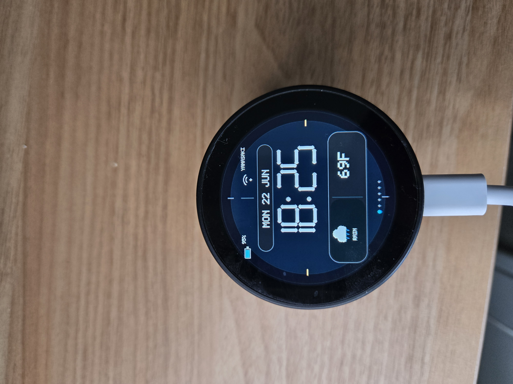

The Home screen is the default dashboard. It shows the current time, date, battery status, Wi-Fi/cloud status, and quick status indicators.

Use Home to confirm that the device booted correctly and that basic status indicators are visible.

### Weather

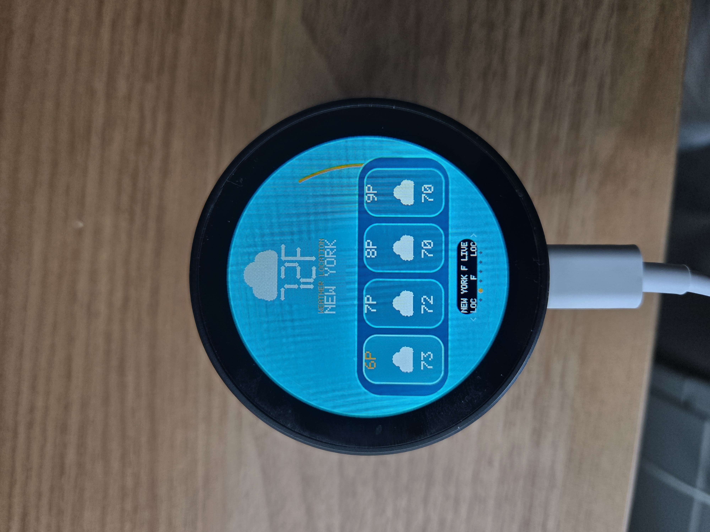

The Weather screen shows the selected weather location and current weather details.

Accepted v1.0.0 behavior:

- The label reads `Weather Location`.
- Tapping the main weather area cycles through configured locations.
- Weather fetch/cache is preserved for Jersey City, New York, Edison, and Mumbai.
- Mumbai uses `Asia/Kolkata`, URL encoded as `Asia%2FKolkata`.

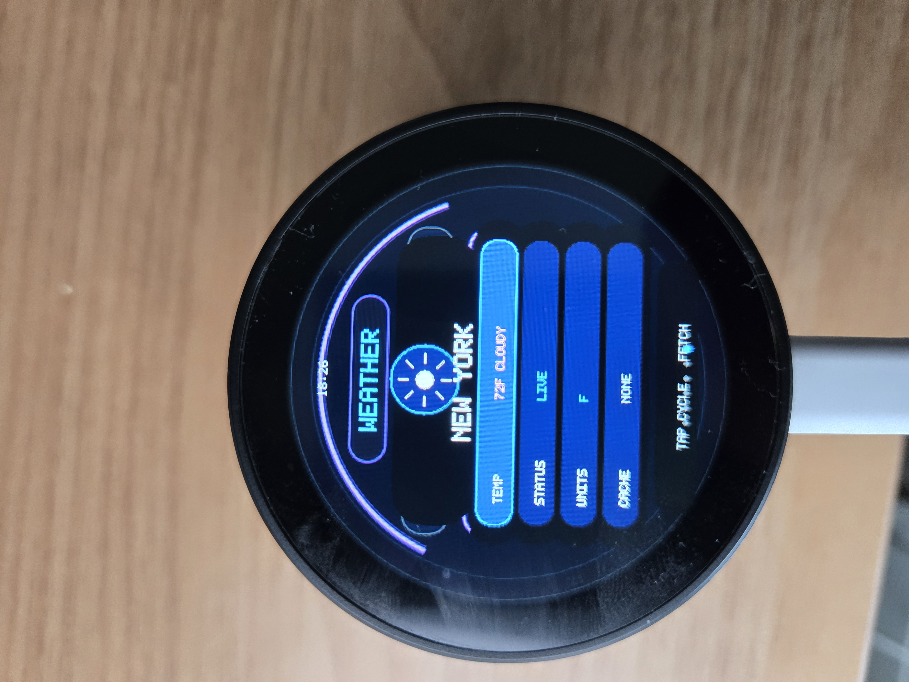

The navigation row supports location changes:

- Tap the left location button to move to the previous location.
- Tap the right location button to move to the next location.
- Tap the units area to toggle weather units when available.

### Music

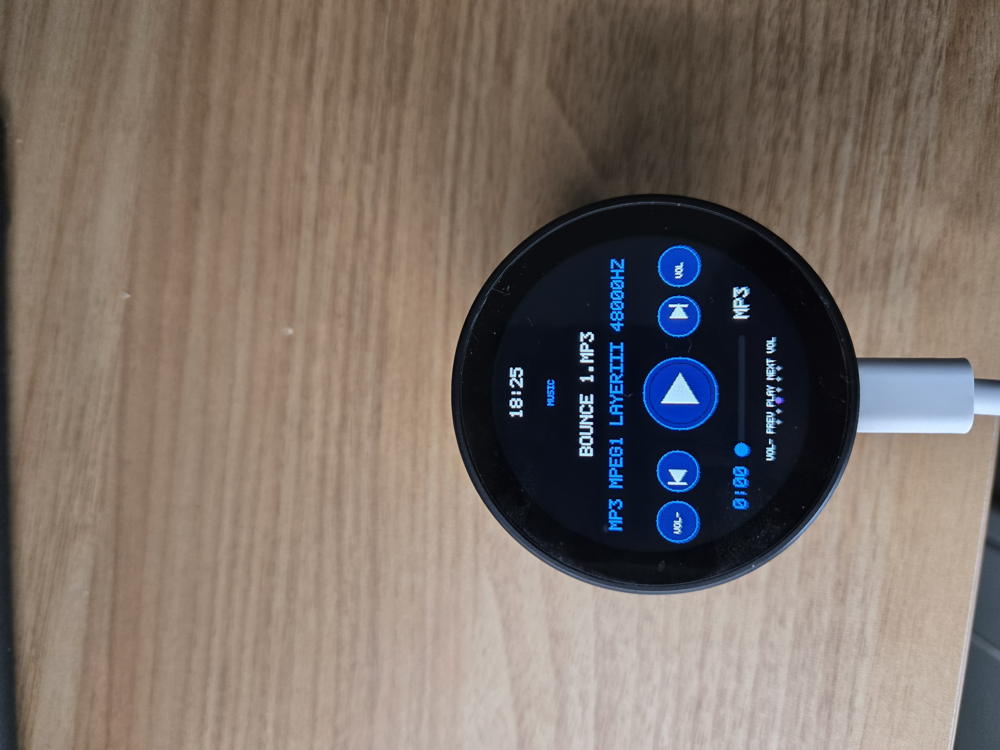

The Music page plays local audio files from the SD card.

Accepted v1.0.0 behavior:

- WAV playback is preserved.
- MP3 playback is preserved.
- MP3 progress is displayed.
- Volume and transport controls use dedicated zones.

The media control layout is:

```text
VOL- | PREV | PLAY/STOP | NEXT | VOL+
```

Music and Internet Radio share the same PCM5101 I2S audio output path, so playback is serialized before switching streams.

### Internet Radio

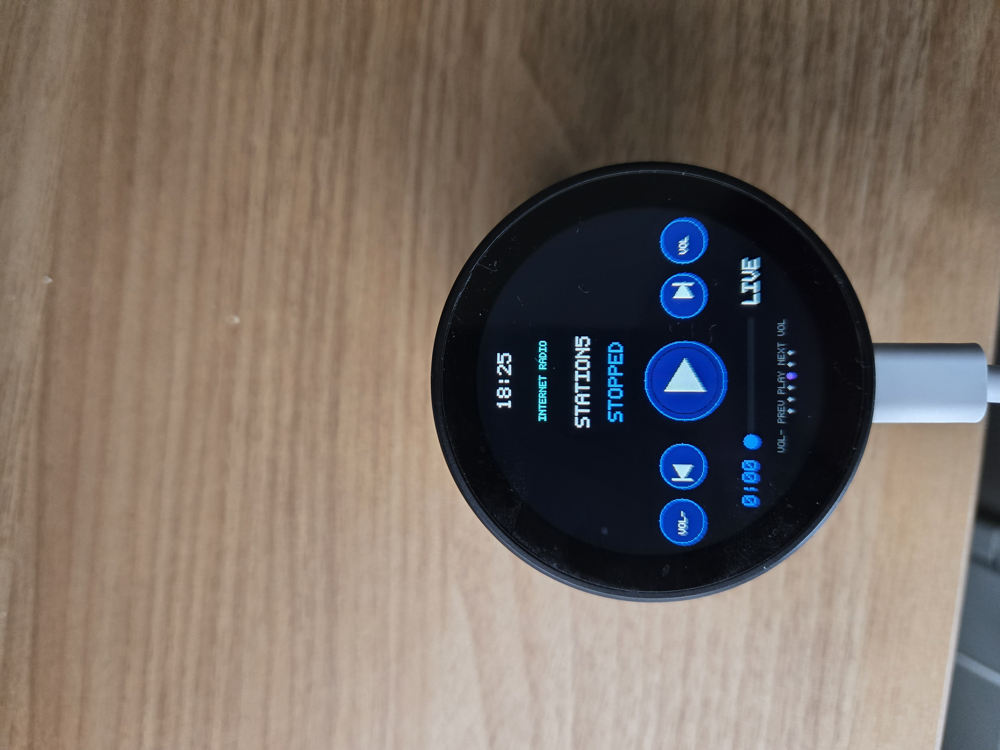

Internet Radio plays configured streaming stations over Wi-Fi.

Accepted v1.0.0 behavior:

- HTTP streams are supported.
- HTTPS streams are supported.
- M3U playlist stations are supported.
- Station names are shown.
- Transport and volume controls use dedicated zones.

Radio station configuration is SD-backed. Keep station entries reachable from the network used by the device.

### Assistant

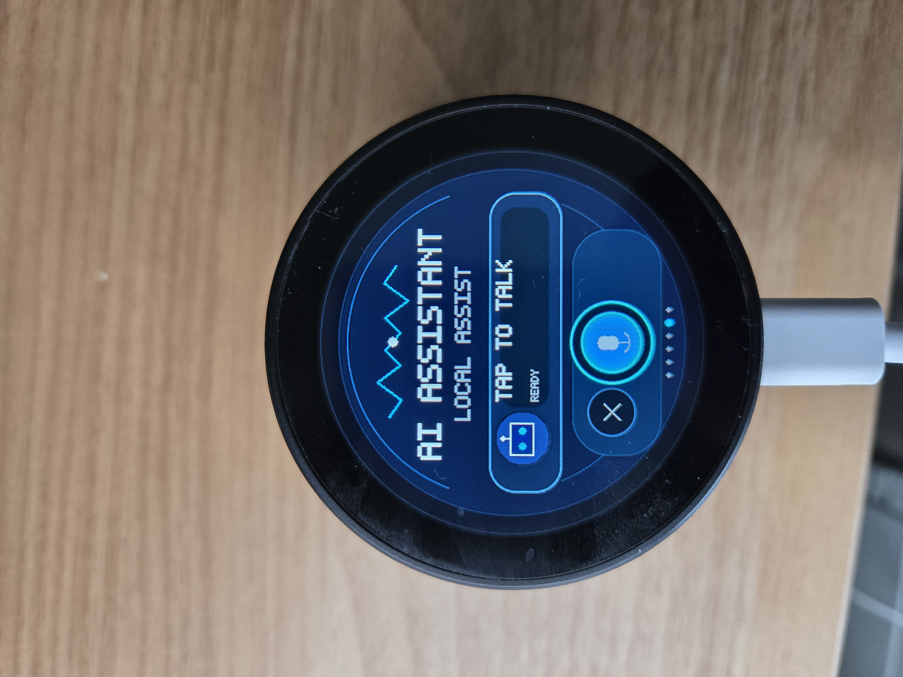

The Assistant page is the UI placeholder for assistant/status interactions. In v1.0.0 it is part of the stable page flow and preserves the accepted visual design.

### Settings overview

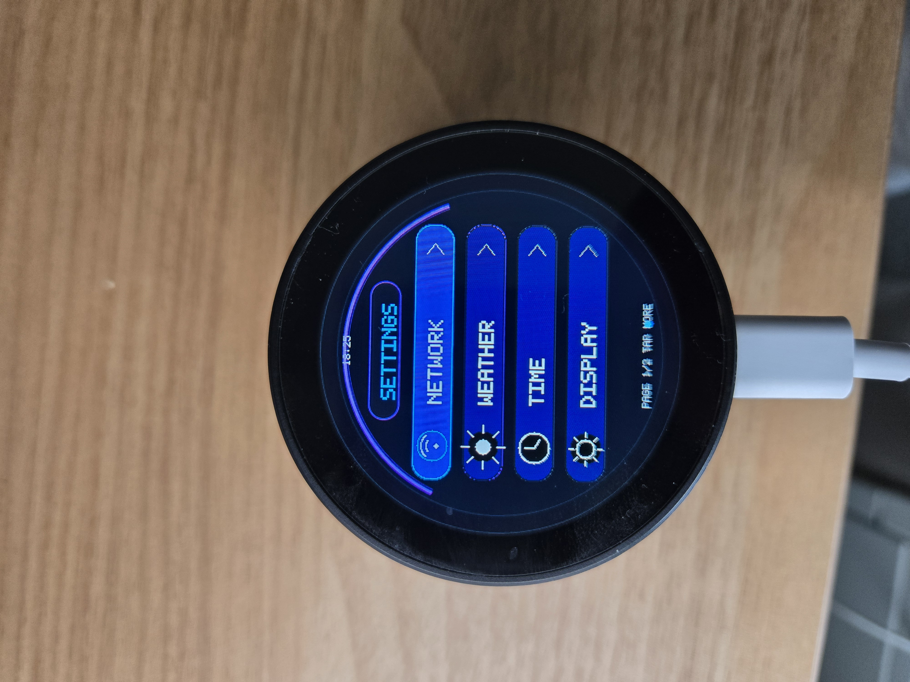

Settings provides access to detail pages for network, weather/time, display, sound, storage, device, and diagnostics.

Swipe or tap through the Settings cards, then tap a card to open its detail page. Use the header/back region to return to the Settings overview.

## Settings detail pages

### Network

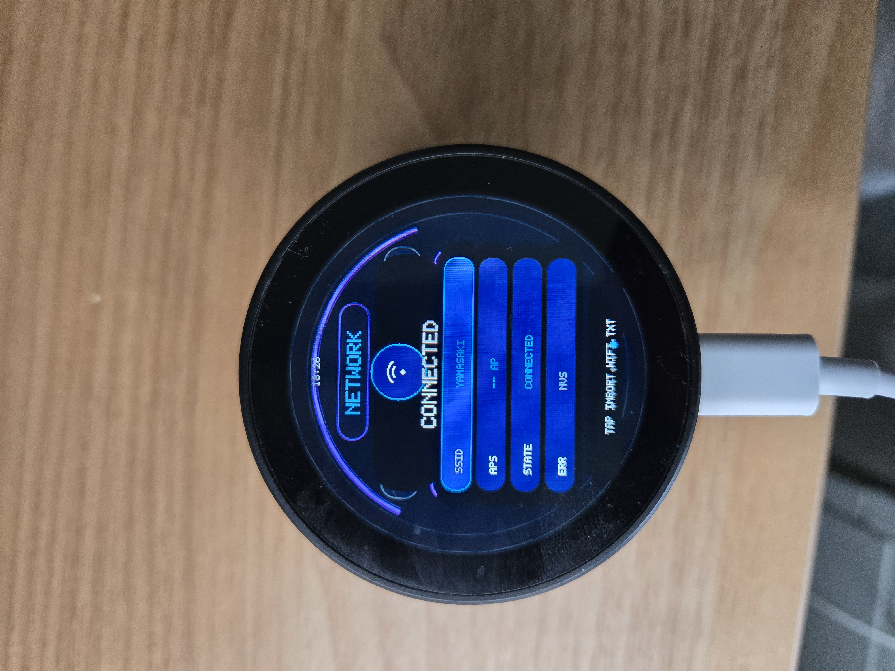

Network shows Wi-Fi status and related connectivity information.

Use this page to confirm whether the device is connected to Wi-Fi before using Weather or Internet Radio.

### Time

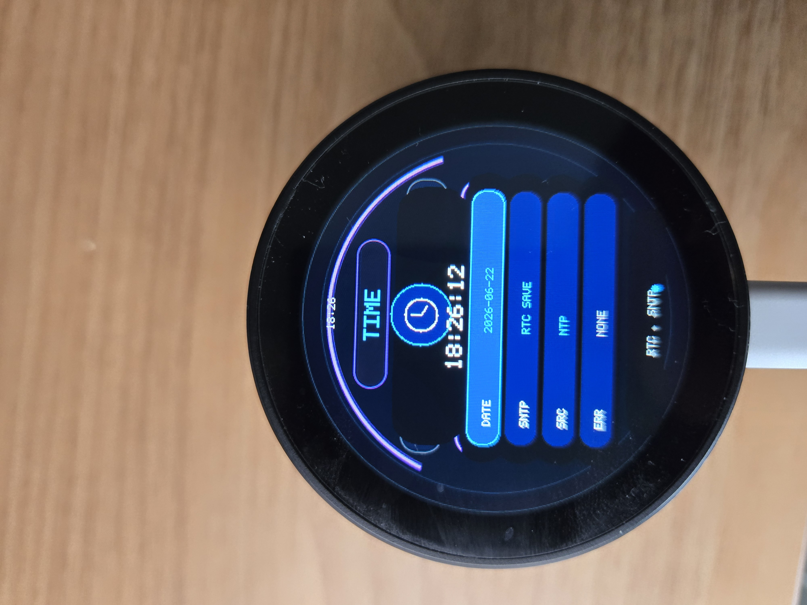

Time shows RTC/NTP related status.

The firmware persists time after NTP synchronization through the PCF85063 RTC path.

### Display

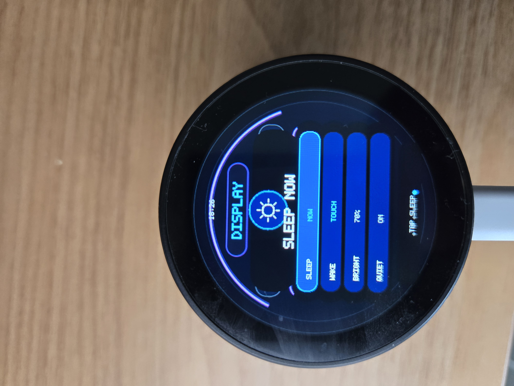

Display provides screen-related controls such as brightness, sleep behavior, and display status.

The v1.0.0 architecture uses raw RGB565 rendering rather than a heavy graphics stack to fit the display and firmware constraints.

### Sound

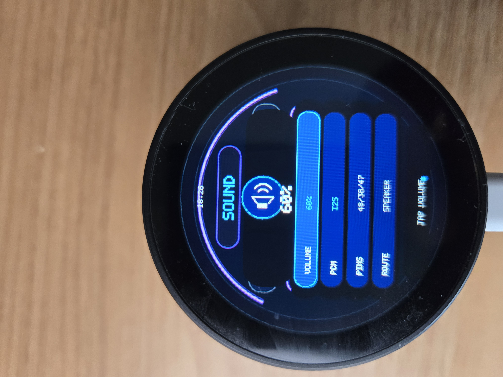

Sound shows audio output and volume-related controls.

The device uses a PCM5101 I2S output path. Music and Internet Radio share this path, so the firmware serializes stop/start transitions.

### Storage

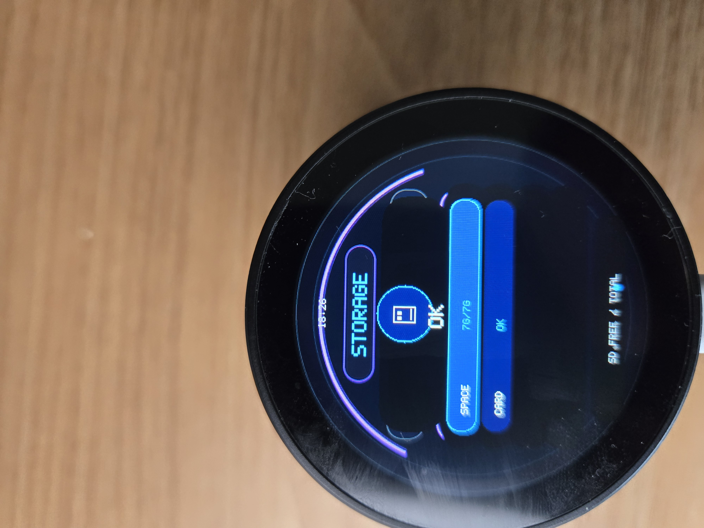

Storage shows SD card status and storage availability.

The SD card is used for assets, local audio, configuration files, and cached data.

### Device

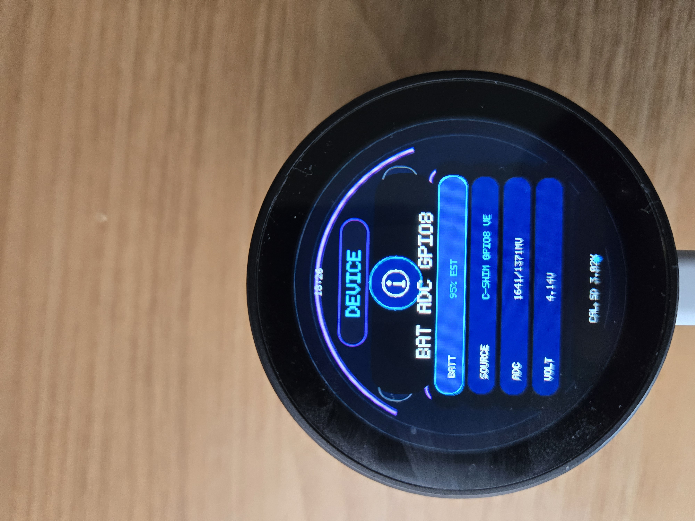

Device shows board and firmware information.

Use this page to confirm hardware and firmware identity during smoke tests.

### Diagnostics

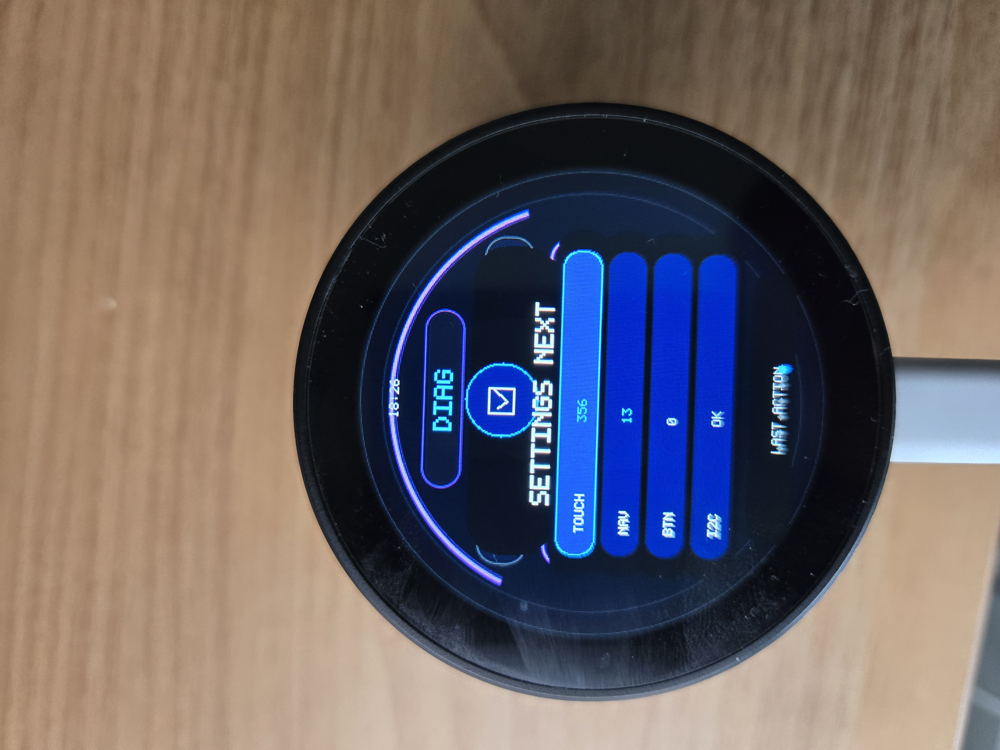

Diagnostics shows runtime health/status information.

Use this page during testing to confirm that core subsystems remain available.

## Touch and navigation summary

Common gestures and controls:

```text
Swipe left/right      Move between main pages
Tap Weather body      Cycle weather location
Tap Weather nav left  Previous weather location
Tap Weather nav right Next weather location
Tap media center      Play/Stop
Tap media left/right  Previous/Next track or station
Tap media side arcs   Volume down/up
Tap Settings card     Open Settings detail
Tap Settings header   Back to Settings overview
```

## SD card expectations

Recommended SD layout:

```text
/AUDIO/                  Local WAV/MP3 files
/AUDIO/RADIO~1.TXT       Internet Radio station list
/LOG.TXT                 Optional logging profile/configuration
```

The exact SD layout can evolve, but v1.0.0 expects SD-backed audio and configuration to remain available for the accepted Music and Radio behavior.

## Bluetooth audio note

The ESP32-S3 supports Bluetooth LE only. It does not support Bluetooth Classic/A2DP sink mode, which is what phones normally use for Bluetooth speaker audio.

Recommended alternatives:

- Use Internet Radio over Wi-Fi.
- Use local MP3/WAV playback from SD.
- Add a future Wi-Fi audio receiver endpoint.
- Use an external Bluetooth Classic/A2DP receiver module if true phone Bluetooth speaker behavior is required.

## v1.0.0 smoke test checklist

After flashing, confirm:

```text
Boot line shows firmware: v1.0.0
Page order is Home,Weather,Music,InternetRadio,Assistant,Settings
Home renders status/time/battery
Weather says Weather Location
Weather previous/next controls fetch/cache locations
Music plays/stops WAV or MP3
MP3 progress updates during playback
Internet Radio plays/stops configured stream
Settings overview opens
Settings detail pages open and return
No Video page appears
```

<!-- RAW-V1-0-0-USERGUIDE -->

## v1.0.1 touch guard note

`v1.0.1` adds a conservative touch ghost guard and disables the Weather center units tap. Weather location previous/next controls remain supported, while Weather units default to Fahrenheit to avoid accidental Celsius switching from phantom taps.

<!-- RAW-V1-0-1-DOC-NOTE -->
